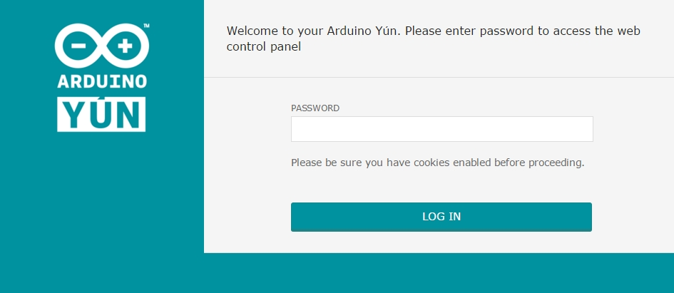
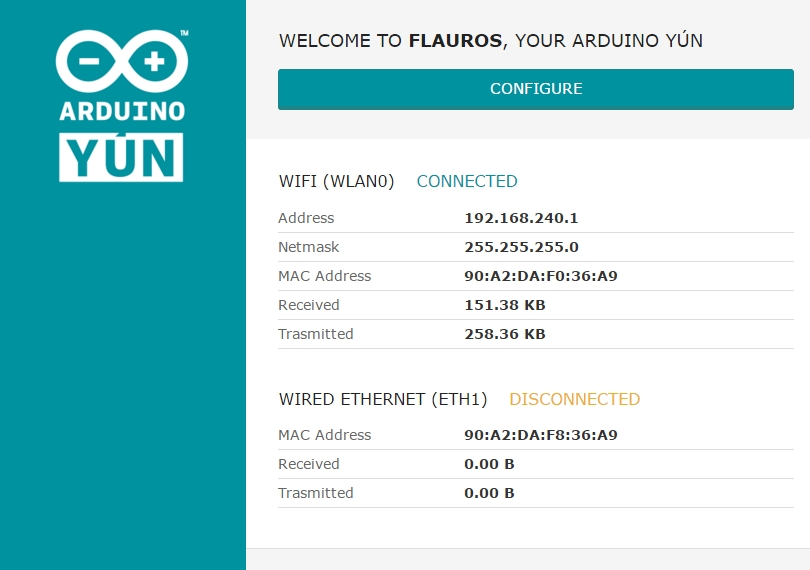
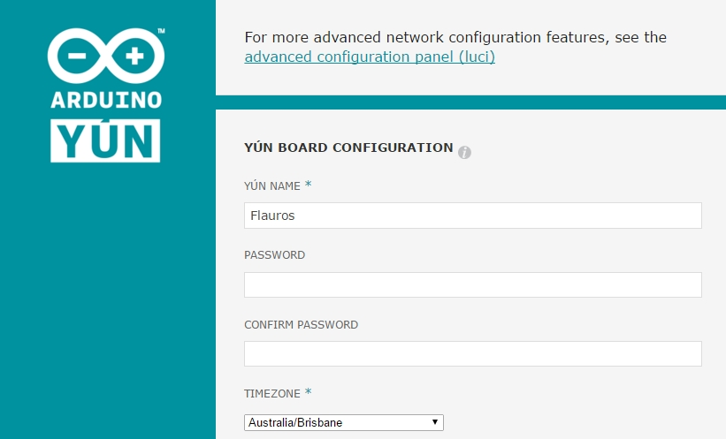
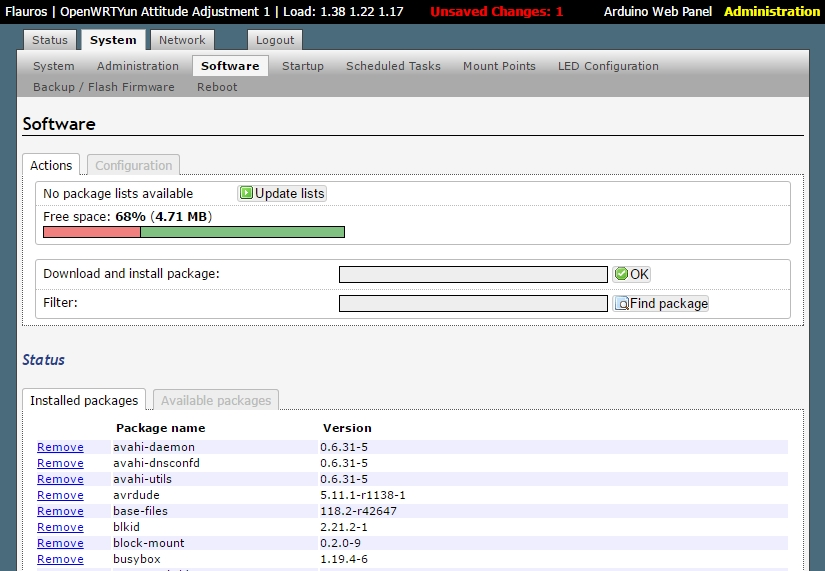
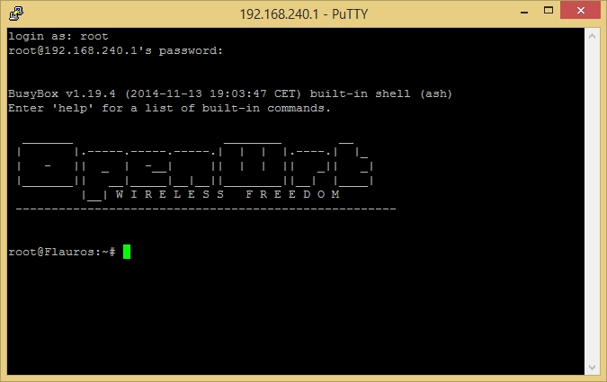

# Connect to the Yun

Your Yun will need to have internet access to install some extra modules. Either connect your Yun with Ethernet or WiFi.

After the Yun has booted (and the white LED is on), you'll need to navigate to the Yun's web interface using your preferred internet browser.

In your browser, enter the Yun's address (http://192.168.240.1 or http://arduino.local by default)

You should see the following page:

If you have no changed the login details, the defaults are:

    Username: root
    Password: arduino

After logging in, you'll see the following screen:

Click on `Configure` to get to the next page:

Finally, click the link the the `advanced configuration panel (luci)`, and you'll be ready to start installing software.

# Installing the Prerequisites

Use the LuCi configuration interface to add the software you need.

1) Go to the __System > Software__ tab

2) Hit the `Update lists` button to update the software package list

3) Find and install the following packages by typing them into the search box and pressing the install button:
- pyserial
- setuptools
- git

# Set up the Yun for Serial communication
Normally, the high-level Linux half of the Yun communicates to the low-level Arduino half using the `Bridge` library. The problem with this bridge connection is that it's really slow for some reason, probably due to the amount of sanitisation it performs on the text.

If you want to use the Yun to process and store your sensor data, you'll want to disable the default serial system so you can implement your own.

You'll find everything you need to create your own Yun-Arduino serial bridge in my [YunSerial repo](https://github.com/Leenix/YunSerial).

Download the repository directly to the Yun by entering the following in the Yun's SSH terminal:

    git clone git://github.com/Leenix/YunSerial.git

Instructions can be found in the repo's`README.md` file.

# Get the ingestor script

1) Log into the Yun's command line (either through SSH or some other means)

2) Navigate to the Yun's SD card folder.

    cd /mnt/sda1

3) Download the code repository for the ingestor (this repo) by typing:

    git clone git://github.com/Leenix/TrafficSink

4) Install the supporting SinkNode library.

    cd TrafficSink
    cd SinkNode
    python setup.py install

# Automatically run sink script

1) Edit the `/etc/rc.local` file by entering:

    nano /etc/rc.local

2) Add the following line to the end of the file (but before exit 0):

    (sleep 10; python /mnt/sda1/TrafficSink/TrafficSink.py &)

# Set up grenade timer

The Arduino portion of the Yun is a little less stable than the Linux processor. Add this script in to restart the microcontroller at the start of every day.

    export VISUAL=nano
    crontab -e

Add the following lines to the cron table:

    #min hour day month dayofweek command
    00 00 * * * reset-mcu
